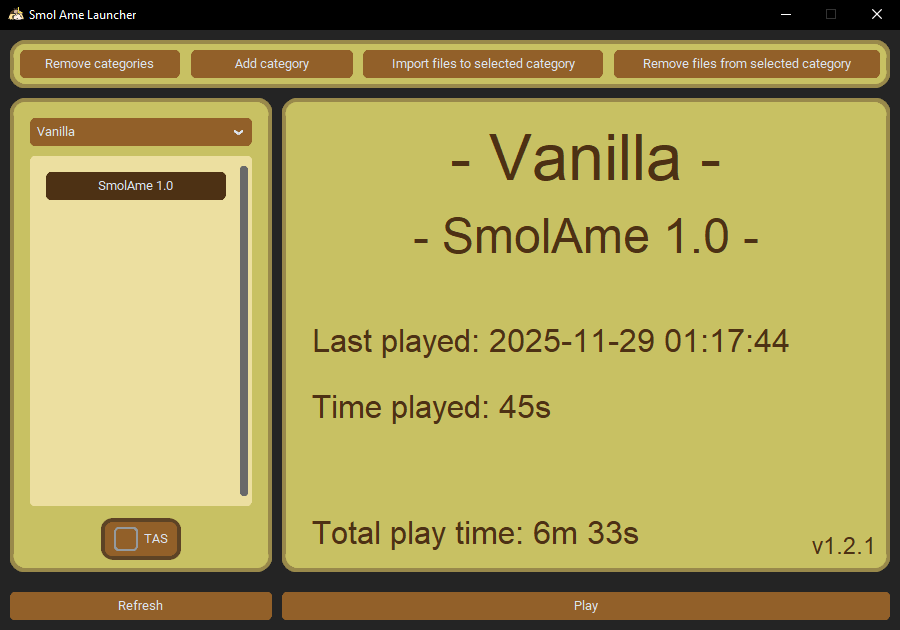
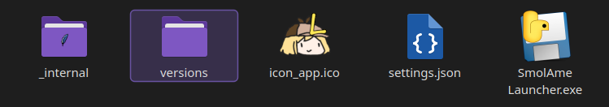
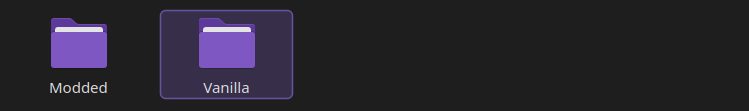
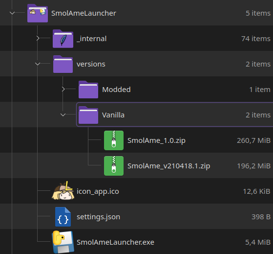

 

  

  <h1 align="center">Smol Ame Launcher</h1>

  

    <i>Keep all your Smol Ame versions in one easy to access place.</i>
  

# About

When speedrunning the indie game [Smol Ame](https://moocow-games.itch.io/smol-ame) by KevinCow (MooCow Games), it is often optimal to use different versions of the game for different stages and categories. 
This can result in a bit of a mess when runners have to juggle multiple copies of the game and it takes up a needless amount of disk space. 
The Smol Ame Laucher is made to help organize the various game versions in a simple and efficient way.
Sort the game versions into custom defined categories and launch the version you wish to play through the launcher.

    
    <figcaption>The Smol Ame Launcher interface.</figcaption>

 

# Features

* Store and sort Smol Ame game versions.

* Launch your desired game version and play some Smol Ame.

* Customize the colors of the the interface by editing HEX codes in  the "settings.json" file.

# How to Use

<!-- **If you would rather watch a video guide then go [here](https://www.youtube.com/watch?v=tgFAWxCUGZY).** Note that this is slightly outdated by now but the workflow remains mostly the same. -->

1. Download the most recent release [here](../../releases). Download the .zip file and extract it in your desired location. Navigate into the extracted folder, it should contain the files and directories seen in the image below.

    

2. Before running the launcher we need to set up categories and install the desired versions of Smol Ame. To do this, first navigate into the "versions" folder (highlighted in the image above).

3. The versions directory is where the different version categories are sorted. The launcher comes with the categories "Modded" and "Vanilla" pre-installed (as seen in the image below). To create a new category, simply create a new folder in the versions directory. To remove categories, simply delete the associated folder.

    

4. To install any Smol Ame version into the launcher, copy the .zip archive of the desired game version into any of the category directories (see how to download game versions [here](#download-game-versions)). In the example image below, we have installed versions 1.0 and 0418 in the Vanilla category.

    

5. We are now ready to play some Smol Ame! Return to the main directory and run SmolAmeLauncher.exe. Choose the category from the dropdown menu on the top left corner, select the game version from the list underneath and hit Play in the bottom right. If any game versions or categories do not appear in the launcher, try clicking the Refresh button in the bottom left.

In step 4 above, it is essential that the game folder is compressed into a .zip format. Other compression formats may not work. Fortunately, most game versions are available in this format by default in the download sources listed below.

The Smol Ame Launcher is currently only available for Windows, however, both Smol Ame and the Launcher run well using Wine, especially on the latest versions Proton-GE.

# Download Game Versions

The latest official version of Smol Ame is always available on [itch.io](https://moocow-games.itch.io/smol-ame).
For a repository of all published versions (official, testing, and speedrun patch versions), see the resources tab on [speedrun.com/smol_ame](https://www.speedrun.com/smol_ame/resources).
Modded versions used for speedrunning can be found under the resources tab on [www.speedrun.com/smol_ame](https://www.speedrun.com/smol_ame/resources).
Alternatively, join the Smol Ame Speedrunning community Discord server [here](https://discord.gg/WpZydmdUGP) to browse the game-versions and modded-game-versions channels.

# Credits

- [KevinCow](https://bsky.app/profile/kevincow.bsky.social): Developer of the Smol Ame game.
